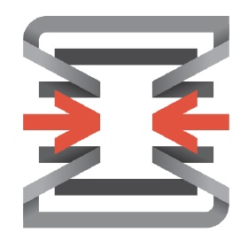

# ioBroker.opnsense

**Tests:** 

## opnsense adapter for ioBroker

Describe your project here
## How-To

Please provide your feedback here

## Known issues

## To-Do
* [ ] Documentation
## Changelog
<!--
	Placeholder for the next version (at the beginning of the line):
	### **WORK IN PROGRESS**
-->

## Support me
If you like my work, please consider a personal donation  
(this is an personal Donate link for me - Seqway aka Dirk, no relation to the ioBroker Project !)  

## What is Sentry.io and what is reported to the servers of that company?
Sentry.io is a service for developers to get an overview about errors from their applications. And exactly this is implemented in this adapter.

When the adapter crashes or an other Code error happens, this error message that also appears in the ioBroker log is submitted to Sentry. When you allowed iobroker GmbH to collect diagnostic data then also your installation ID (this is just a unique ID **without** any additional infos about you, email, name or such) is included. This allows Sentry to group errors and show how many unique users are affected by such an error. All of this helps me to provide error free adapters that basically never crashs. 

## Changelog

### 0.0.1
* (Seqway) initial alpha code without testing yet - coming soon

## License
MIT License

Copyright (c) 2020 Seqway <dirkscheck@gmx.de>

Permission is hereby granted, free of charge, to any person obtaining a copy
of this software and associated documentation files (the "Software"), to deal
in the Software without restriction, including without limitation the rights
to use, copy, modify, merge, publish, distribute, sublicense, and/or sell
copies of the Software, and to permit persons to whom the Software is
furnished to do so, subject to the following conditions:

The above copyright notice and this permission notice shall be included in all
copies or substantial portions of the Software.

THE SOFTWARE IS PROVIDED "AS IS", WITHOUT WARRANTY OF ANY KIND, EXPRESS OR
IMPLIED, INCLUDING BUT NOT LIMITED TO THE WARRANTIES OF MERCHANTABILITY,
FITNESS FOR A PARTICULAR PURPOSE AND NONINFRINGEMENT. IN NO EVENT SHALL THE
AUTHORS OR COPYRIGHT HOLDERS BE LIABLE FOR ANY CLAIM, DAMAGES OR OTHER
LIABILITY, WHETHER IN AN ACTION OF CONTRACT, TORT OR OTHERWISE, ARISING FROM,
OUT OF OR IN CONNECTION WITH THE SOFTWARE OR THE USE OR OTHER DEALINGS IN THE
SOFTWARE.